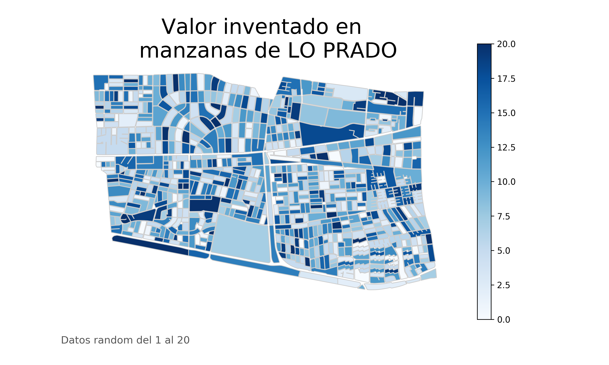

# Esto es lo que quiero decir en la página

## Soy lA nATI CHUBRETOVIC Y ESTA ES UNA PRUEBA

[Link a otra parte de la página](https://natichubretovic.github.io./nati).

|      | 20 por ciento de asistencia     |

st=>start: Start|past:>http://www.google.com[blank]
e=>end: End|future:>http://www.google.com
op1=>operation: My Operation|past
op2=>operation: Stuff|current
sub1=>subroutine: My Subroutine|invalid
cond=>condition: Yes
or No?|approved:>http://www.google.com
c2=>condition: Good idea|rejected
io=>inputoutput: catch something...|future

st->op1(right)->cond
cond(yes, right)->c2
cond(no)->sub1(left)->op1
c2(yes)->io->e
c2(no)->op2->e
